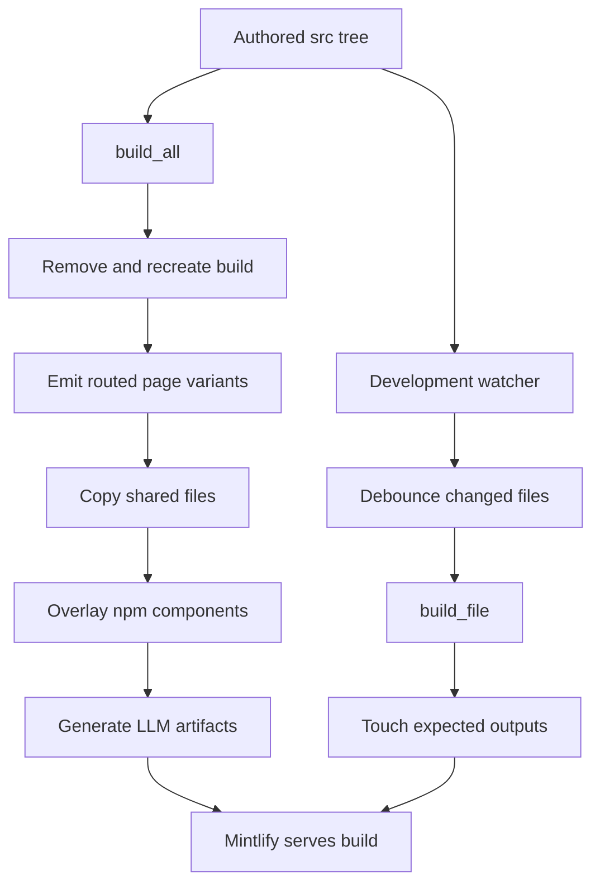
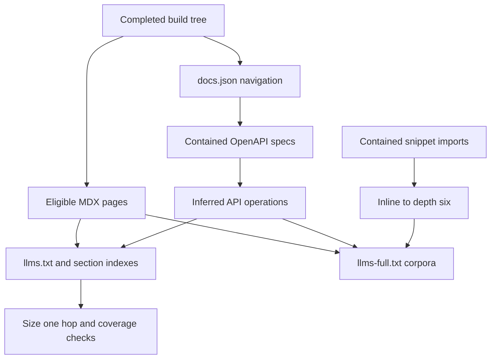

# Build System Architecture

`DocumentationBuilder` is the boundary between authored `src/` content and Mintlify's generated `build/` deployment tree. `build/` is disposable: a full build removes it before regenerating it, and contributors must edit `src/`, not output files.

## Entrypoints and full-build lifecycle

`build_command` verifies that `src/` exists, creates the output directory, and calls `DocumentationBuilder(src, build).build_all()`; a missing source directory returns exit code 1. `dev_command` normally does that full build, then watches `src/` while it runs `mint dev --port 3000` from `build/`. `--skip-build` uses the current output tree (and only warns if it is absent). A missing Mint executable, a failed initial build, or a nonzero Mint exit makes development mode fail.

This shows why a full build is the consistency operation: only it clears stale output, overlays package components, and produces the LLM artifacts.

`build_all()` orders its work deliberately: Python OSS, JavaScript OSS, unversioned Deep Agents Code, unversioned OpenWiki, ordinary LangSmith, Managed Deep Agents variants, shared files, npm snippets, `llms.txt`, and `llms-full.txt`. The final two stages therefore inspect the completed tree, and the npm package can intentionally win over source-tree component copies.

## Routing domains

The builder selects an output domain rather than mirroring every source path.

| Source domain | Generated location | Render behavior |
| --- | --- | --- |
| Most `src/oss/` content | `build/oss/python/...` and `build/oss/javascript/...` | Rendered once per language. A leading `python` or `javascript` source directory is included only in its matching render and is removed from the output path. |
| `src/oss/deepagents/code/` | `build/oss/deepagents/code/...` | One unprefixed set, using the Python conditional branch. |
| `src/oss/openwiki/` | `build/oss/openwiki/...` | One unprefixed set, using the Python conditional branch. |
| Ordinary `src/langsmith/` | `build/langsmith/...` | One unversioned render using the Python conditional branch. |
| Direct `src/langsmith/managed-deep-agents*.mdx` pages | `build/langsmith/python/...` and `build/langsmith/javascript/...` | Rendered for both languages; no ordinary unversioned page is emitted. |
| Shared and other root content | Source-relative path below `build/` | Copied or processed once. |

Managed Deep Agents is the LangSmith exception. Redirects in `docs.json` send its old unversioned URLs to Python routes, while the builder emits language-prefixed variants and rewrites unversioned Managed Deep Agents links to the active language route.

For a language-specific render, eligible absolute `/oss/...` links gain `/oss/python/...` or `/oss/javascript/...`. Already-prefixed URLs, image paths, and the Deep Agents Code and OpenWiki roots remain unchanged because those products do not have language-prefixed pages.

## Output-boundary processing

Markdown is transformed only as it is written to `build/`; source files remain authored input. The sequence is standard preprocessing, language-specific snippet import rewriting when applicable, OSS-link rewriting, Managed Deep Agents-link rewriting, then the generated contributor footer. `.md` output is renamed to `.mdx`.

Standard preprocessing resolves scoped `@[LinkName]` references through `SCOPE_LINK_MAPS`, adds UTM parameters to eligible LangSmith CTA links, and resolves language blocks. `:::python` is retained for a Python target and removed for JavaScript; `:::js` behaves conversely. Unsupported block labels are left intact, and escaped `\:::` is unescaped as literal text. Missing autolinks are logged rather than failing the build.

Except for root `index.mdx` and any path beneath `snippets/`, generated Markdown receives an output-only callout with GitHub edit and issue links. It is not added to authored content.

The supported set is Markdown, JSON and YAML, common image and video formats, CSS, JavaScript, JSX/TSX, text, HTML, and WOFF/TTF fonts. `TEMPLATE.mdx` and unsupported extensions are skipped. `docs.yml` is parsed and emitted as JSON; other supported non-Markdown inputs use `copy2`.

## Shared assets and language-aware snippets

`is_shared_file()` prevents `docs.json`, selected root pages, paths under `snippets`, `images`, `.well-known`, or `fonts`, and all `.css` and `.js` files from being duplicated during the OSS passes. The shared-file phase copies them once after routed content.

MDX snippets are special because pages at arbitrary depths import them. Each shared Markdown snippet produces three forms:

- its source-relative default under `build/snippets/`, with Python-resolved links for unversioned consumers;
- a Python form below `build/snippets/python/`; and
- a JavaScript form below `build/snippets/javascript/`.

A versioned import such as `from '/snippets/component.mdx'` is redirected to its matching language form. These copies use absolute, language-prefixed routes rather than fragile relative links. JSX and TSX snippet components are shared directly.

After source snippets, the builder overlays `PatternEmbed.jsx` and `ExampleEmbed.jsx` from `@langchain/docs-sandbox` into `build/snippets/`, and `ChatLangChainEmbed.js` into the build root. Missing package directories or expected files warn; present package files overwrite source copies.

## Development rebuild boundary

The watcher queues supported create and modify events, ignores editor backups and selected hidden temporary files, debounces them for 0.2 seconds, and calls `build_file()` in a worker thread (up to four concurrent workers for a batch). It then touches expected generated files to prompt Mintlify hot reload.

Incremental routing follows `build_file()`'s path classification: normal OSS files produce both language variants, language-agnostic OSS pages produce one output, LangSmith produces one output except for Managed Deep Agents variants, shared files copy once, and other root files are simple copies. It is not a substitute for `build_all()`:

- it does not collect every shared file, apply the npm overlay, or regenerate LLM artifacts;
- deletion removes only the source-relative output path instead of applying routing, so versioned and special-routed variants can remain until a full build; and
- its touch calculation treats `langsmith` as unversioned, so a changed Managed Deep Agents source can rebuild its language variants without touching those variant paths for hot reload.

Run a full build after changes with cross-file, package, navigation, deletion, or derived-artifact effects.

## LLM index and full-corpus contract

After the final tree exists, the builder creates the index and corpus families below.

This shows that `llms.txt` is a complete index of published MDX and inferred API pages, whereas `llms-full.txt` contains page bodies with reusable Markdown expanded.

### `llms.txt`

Eligible MDX pages exclude `snippets/` and pages with `noindex: true`. The index also derives entries for Mintlify-generated OpenAPI operation pages, which have no source MDX: it recursively finds navigation `openapi` groups in `docs.json`, reads a contained JSON specification, skips `x-hidden` operations, and derives Mintlify-style paths from the first tag and operation summary or ID. Duplicate operation slugs receive numeric suffixes; OpenAPI tag underscores are preserved.

Small sections are inlined in root `llms.txt`; large sections become `llms.txt` files in directory paths, linked directly from root. The output validator raises `ValueError` if root or a linked section exceeds 50,000 characters, a linked section points to another index, a linked index is missing, any page is duplicated, or the unique page count does not equal the expected generated MDX-plus-OpenAPI count. Section splitting always uses the exact filename `llms.txt`, because Mintlify serves that filename at a path.

### `llms-full.txt`

The full corpus also excludes snippets and `noindex` pages. It strips frontmatter, records each page heading and source URL, and expands recognized default-quote snippet imports by replacing self-closing component uses with the snippet body. Inlining is recursive to depth six and removes import lines; out-of-tree snippet targets are ignored.

To avoid combining duplicate language renders in one giant corpus, `oss/python/llms-full.txt` and `oss/javascript/llms-full.txt` hold those variants, while root `llms-full.txt` links to them and holds unversioned pages. Generated OpenAPI pages contribute only a heading and source URL because there is no MDX body.

## Containment and test boundary

Collection rejects every symlink and verifies each resolved file remains below its requested source root. `_resolve_within()` protects paths derived from editable MDX and `docs.json`: it is used before reading OpenAPI specs or snippet imports and before writing section indexes. A candidate that escapes the permitted build subtree is ignored or refused rather than read or written.

`tests/unit_tests/test_builder.py` is the focused contract suite. It exercises OpenWiki and Deep Agents Code exceptions, language link routing, language-scoped snippets and their resolved links, Managed Deep Agents output, symlink rejection, and snippet containment. Its LLM tests cover OpenAPI hidden and duplicate operations, index sizing and one-hop coverage, exact index filenames, full-corpus language splitting, and snippet inlining. Extend those tests when altering a routing, eligibility, containment, or generated-artifact invariant.

## Related pages

- [Source directory map](/openwiki/architecture/source-map.md)
- [Preprocessing](/openwiki/concepts/preprocessing.md)
- [Versioning](/openwiki/concepts/versioning.md)
- [npm snippets](/openwiki/integrations/npm-snippets.md)
- [Builder tests](/openwiki/testing/builder-tests.md)
- [Local development](/openwiki/workflows/local-development.md)
