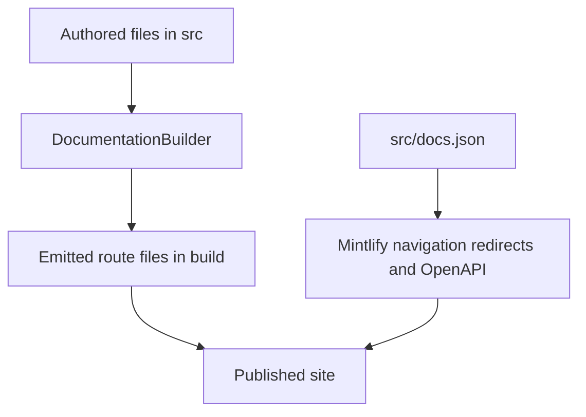

`src/` is the authored documentation tree. Publication has two independent contracts:

- `pipeline/core/builder.py` discovers and transforms files into `build/`; this determines which routes exist.
- `src/docs.json` gives Mintlify its products, menu placement, tabs, groups, generated OpenAPI sections, and redirects; this determines how routes are presented and which legacy URLs resolve.

A route may exist without being placed in navigation, and a navigation label does not name its source directory. For example, `src/langsmith/fleet/` supplies `/langsmith/fleet/...`, although readers see it as **No-code agents**. Change the content and the navigation contract together.

The builder owns emitted files; `docs.json` independently owns navigation, redirects, and generated-reference placement.

## Source-to-route map

| Authored domain | Emitted route family | Primary navigation placement |
| --- | --- | --- |
| Root MDX such as `src/index.mdx` | Corresponding root route | Lifecycle → Home or Build |
| Shared `src/oss/` content, excluding unversioned products | `/oss/python/...` and `/oss/javascript/...` | Lifecycle → Build language dropdowns |
| `src/oss/python/` and `src/oss/javascript/` | The matching language tree, with that leading source segment removed | Matching Build dropdown |
| `src/oss/openwiki/` | `/oss/openwiki/...` once | Build → OpenWiki |
| `src/oss/deepagents/code/` | `/oss/deepagents/code/...` once | Products and setup → Deep Agents Code |
| Ordinary `src/langsmith/` content | `/langsmith/...` | Test, Deploy, Monitor, or Products and setup |
| `src/langsmith/managed-deep-agents*.mdx` | `/langsmith/python/...` and `/langsmith/javascript/...` | Build → Managed Deep Agents |
| `src/langsmith/fleet/` | `/langsmith/fleet/...` | Products and setup → No-code agents |
| `src/snippets/` | Imported MDX/components, not public pages | Consumed by authored pages |

## Route construction and safety boundaries

`build_all()` clears the output, emits the two OSS language trees, then the deliberately unversioned OSS products, ordinary LangSmith content, Managed Deep Agents variants, and shared files. Shared OSS sources are processed once for each target, including conditional-fence resolution. Use fences for language differences rather than duplicating a shared source.

OpenWiki and Deep Agents Code are deliberate exceptions: each emits once and uses the Python conditional-content branch. Links to either product stay unprefixed; links from an unversioned product to ordinary OSS content resolve to the Python tree.

For a targeted page, preprocessing occurs before route-link rewriting. The builder scopes unqualified MDX snippet imports to `/snippets/python/` or `/snippets/javascript/`, inserts the target language in eligible absolute `/oss/` links, and redirects unversioned Managed Deep Agents links within targeted content to the matching language route. Already-qualified links, image paths, and the unversioned product roots are left unchanged.

The source collector is also a security boundary: it skips every symlink and rejects a regular file whose resolved path lies outside the collection root. A committed source path therefore cannot make build artifacts include host files. Builder tests cover these route boundaries, rewriting behavior, and containment.

### Managed Deep Agents

A direct `managed-deep-agents*.mdx` page is excluded from ordinary LangSmith output and emitted into both language route trees. `docs.json` redirects unversioned legacy Managed Deep Agents URLs to their Python counterparts rather than serving orphaned duplicate pages. The Build dropdowns place these routes into **Get started**, **Agent capabilities**, and **Build and deploy** groups.

## Navigation map

### Agent development lifecycle

**AGENT DEVELOPMENT LIFECYCLE** contains **Home**, **Build**, **Test**, **Deploy**, and **Monitor**. Build uses Python and TypeScript dropdowns, each with ten tabs. Test has six tabs: Get started, Datasets & Experiments, Evaluators, Annotation Queues, Test from Playground, and Test from Studio. Deploy has six tabs, including Sandboxes. Monitor has Overview, Trace, Debug, Observe, and Reference.

This hierarchy is a `docs.json` concern: Test, Deploy, and Monitor take their pages from flat `src/langsmith/` source families rather than directory-derived menu trees. In particular:

- **Test from Playground** contains `test-from-playground` and `run-evaluation-from-playground`; it is a Test placement, not a standalone source domain.
- **Monitor → Trace** is where integration guides such as Claude Code, OpenAI Codex, and Cursor tracing belong. Their routes remain direct `/langsmith/trace-...` routes.
- **Monitor → Reference** contains the LangSmith REST API reference alongside SDK and SmithDB migration entry pages.

### Products and setup

**PRODUCTS AND SETUP** has five menu items: **LangSmith setup**, **LLM Gateway**, **No-code agents**, **Engine**, and **Deep Agents Code**. LangSmith setup alone is tabbed: Overview, Account, Cloud, BYOC, Self-hosted, and Govern.

| Surface | Route/source relationship and navigation consequence |
| --- | --- |
| BYOC | Flat `src/langsmith/byoc*.mdx` pages are all placed in the BYOC setup tab. The overview describes a LangChain-cloud control plane and customer-cloud data plane; onboarding creates a cross-account role and advances a plane from `Requested` through `Provisioning` to `Active`. A workspace belongs permanently to the selected data plane. |
| Self-hosted | Flat `self-host*.mdx` source pages are organized into configuration and operations groups in the Self-hosted tab. The SmithDB group is configured but hidden; `self-host-smithdb-metrics` appears in visible Reference. |
| Playground | Playground is documented through direct LangSmith routes rather than a separate top-level menu item: prompt concepts and configuration are in Deploy → Prompt & Context Hub, model-provider configuration is linked from that surface, and dataset testing belongs in Test → Test from Playground. The self-hosted service map identifies Playground as the service that forwards model requests, including requests to custom model servers. |
| Coding-agent tracing | `trace-claude-code`, `trace-with-codex`, and `trace-with-cursor` are direct LangSmith pages placed in Monitor → Trace integrations. Each uses an opt-in configuration plus a LangSmith API key; secret redaction defaults on. Cursor attachment bytes bypass redaction and require disabling attachments when that data must not be uploaded. |
| LLM Gateway | Flat `llm-gateway*.mdx` pages are divided between Core capabilities, Administration and governance, and Advanced. Credits are Core capabilities, while model-access policies are Administration and governance. |
| No-code agents | The visible label maps to the `fleet/` directory and route prefix. |
| Engine | Flat `engine*.mdx` pages are direct menu entries: overview, issue workflow, GitHub integration, categories, webhooks, security, and self-hosted operation. |
| Deep Agents Code | The unversioned `/oss/deepagents/code/...` surface has an expanded Configuration group rooted at `oss/deepagents/code/configuration`. |

### Generated REST API placement

Mintlify generates endpoint pages from the `openapi` declarations at deploy time; those routes are not authored MDX pages and should not be added manually to the build tree.

| Generated section | Navigation location | Spec source | Generated route directory |
| --- | --- | --- | --- |
| Agent Server API | Deploy → Get started → Reference | `src/langsmith/agent-server-openapi.json` | `langsmith/agent-server-api` |
| Control Plane API | Deploy → Get started → Reference | `https://api.host.langchain.com/openapi.json` | Mintlify remote-spec output |
| LangSmith REST API | Monitor → Reference | `src/langsmith/langsmith-platform-openapi.json` | `langsmith/smith-api` |

The surrounding authored pages (`server-api-ref`, `api-ref-control-plane`, and `smith-api-ref`) are navigational entry points; they do not replace generated endpoint documentation.

## Safe change procedure

1. Identify the authored domain and desired emitted route; never infer either from a visible navigation label.
2. Add or edit the MDX source, then add its emitted route to the exact product, menu item, tab, and group in `src/docs.json`.
3. On a public route rename, add or retain a `docs.json` redirect rather than authoring a duplicate compatibility page.
4. For shared OSS and Managed Deep Agents, inspect both language outputs, including fence resolution, rewritten links, and scoped snippet imports. Inspect only the unversioned output for OpenWiki and Deep Agents Code.
5. For an API reference change, update the specification source and its `openapi` declaration instead of creating endpoint MDX. For a navigation-only change, do not alter the spec.
6. Run `make build` and `make broken-links`; extend builder tests when emission, rewrite, or containment behavior changes.

## Related pages

- [Build system architecture](/openwiki/architecture/build-system.md)
- [Versioning](/openwiki/concepts/versioning.md)
- [Mintlify integration](/openwiki/integrations/mintlify.md)
- [Reference documentation](/openwiki/integrations/reference-docs.md)
- [Adding pages](/openwiki/operations/adding-pages.md)
- [Quickstart](/openwiki/quickstart.md)
