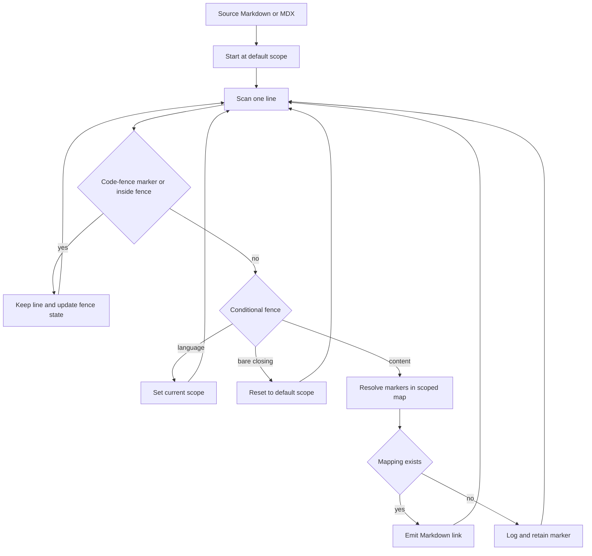

# Cross-Reference Links

`@[ref]` is authoring syntax for a semantic link to an API-reference symbol. Rather than hard-coding a destination URL in Markdown or MDX, authors name a class, method, function, or module and the preprocessor resolves the name through the active language scope. The scoped registry owns the destination, including its host.

This is distinct from a normal site link. `make check-cross-refs` verifies source markers against the local scoped maps. Mintlify checks the generated `build/` site separately: `make broken-links` checks links and redirects, while `make broken-links-with-anchors` also checks anchors. Use the source check after changing `@[...]` usage or its registry entries; use the generated-site check after changes that can affect routes, ordinary links, anchors, or redirects.

## Authoring syntax

Use these forms outside a regular fenced code block:

```markdown
Use @[StateGraph] to define a graph.
Read @[the graph reference][StateGraph].
Pass @[`StateGraph`] to make code formatting part of the link text.
```

<!-- openwiki: broken internal link [url] file "url" does not exist. Fix the href or restore the target, then delete this comment. -->
<!-- openwiki: broken internal link [url] file "url" does not exist. Fix the href or restore the target, then delete this comment. -->
<!-- openwiki: broken internal link [url] file "url" does not exist. Fix the href or restore the target, then delete this comment. -->
A known `StateGraph` renders respectively as `[StateGraph](url)`, `[the graph reference](url)`, and ``[`StateGraph`](url)``. The titled form is `@[title][ref]`; a backtick-wrapped name is also accepted in that form, but automatic backticks in the visible title apply only to the simple backticked form.

To show the marker rather than create a link, escape its at sign:

```markdown
Write \@[StateGraph] when documenting the syntax.
```

The resolver does not transform an escaped marker, then removes the escape during its final unescape pass. The output therefore displays literal `@[StateGraph]`.

## Resolver flow and scope

`preprocess_markdown()` calls `replace_autolinks()` before it adds UTM parameters and renders conditional content. This order is essential: the resolver must read conditional fences before rendering removes the branches. It begins in `default_scope`; absent an explicit value, that is the selected `target_language`, which comes from `TARGET_LANGUAGE` or defaults to `python`.



This flow shows line-oriented autolink resolution before conditional rendering; regular code-fence state takes precedence over conditional scope recognition.

A `:::python` or `:::js` line sets the current scope; a bare `:::` resets it to the default. The fence lines remain for the later conditional-rendering pass, while the selected scope applies to subsequent non-fence lines. Thus one marker can resolve to different destinations in separate Python and JavaScript branches:

```markdown
:::python
@[StateGraph]
:::

:::js
@[StateGraph]
:::
```

Do not author a `global` scope. If the resolver encounters it, it logs an error and falls back to the Python map; it does not combine Python and JavaScript mappings.

### Regular fenced code

The resolver recognizes a stripped line beginning with at least three backticks or tildes and toggles a single code-fence state. It copies both fence lines and all enclosed content unchanged. Consequently, markers in backtick, tilde, labelled, extended, or indented fences are not transformed, and a conditional-looking line in such a fence cannot alter the scope.

This is a simple toggle, not delimiter matching. An unclosed recognized fence suppresses autolinking for the rest of the document; keep delimiters balanced and consistent. Escaped markers are unescaped in the final pass even when they occur in fenced content.

## Link-map ownership and failure behavior

`LINK_MAPS` in `pipeline/preprocessors/link_map.py` is the editable registry. Each entry supplies a `scope`, `host`, and `links` mapping. At import time, `_enumerate_links()` flattens entries by scope into `SCOPE_LINK_MAPS`: it prefixes relative values with their entry host and retains values beginning with `http` as absolute URLs. The resolver reads only this flattened map.

To add or repair a destination:

1. Determine the intended destination and the Python and/or JavaScript scopes that publish the consuming content.
2. Add the exact authored name and destination value to the appropriate `LINK_MAPS` entry. Use a relative value for a target under that entry's host; use an absolute URL only for an external target.
3. For an unfenced shared `oss/` page, add the name to both maps. Alternatively, place language-specific prose in `:::python` or `:::js` and map it only in the matching scope.
4. Run the source validator and focused tests. When a reference site moves, repair the registry rather than duplicating hard-coded URLs in documents.

Lookup is an exact, case-sensitive dictionary lookup. A map may intentionally give the same name different destinations in each scope. If a name is absent, `_transform_link()` logs an info-level message with file, line, name, and scope, returns no replacement, and leaves the original marker in output. Preprocessing is therefore inspectable but not a sufficient authoring gate.

## Strict source validation

Run the dedicated validator before merge:

```bash
make check-cross-refs
```

The target runs `scripts/check_cross_refs.py`, which recursively scans `.md` and `.mdx` below `src/`. It imports the resolver's reference, conditional-fence, and code-fence patterns so the validator recognizes the same syntax. For each eligible marker, it reports the source-relative file, line, reference, and required scopes; it exits 1 when any reference is not present in every applicable map. Invalid UTF-8 files produce a warning and are skipped; `snippets/code-samples/` and paths containing `node_modules` are excluded.

| Source-relative location | Required scope(s) for an unfenced marker |
| --- | --- |
| `oss/python/` | `python` |
| `oss/javascript/` | `js` |
| Other `oss/` content | `python` and `js` |
| Non-OSS content | `python` |

Inside a recognized `:::python` or `:::js` region, the validator requires only that scope. A closing or unsupported conditional fence restores the file's default scope list. In shared `oss/` content, an unfenced name must resolve in **all** applicable maps; accepting a match in only one map would allow a generated language version to retain an unresolved marker.

The checker ignores escaped references and markers inside regular recognized code fences. Its fence state is the same simple toggle used by the resolver, so an unclosed fence excludes the remaining lines from validation. Put deliberately unknown example syntax in a recognized fence or escape it rather than leaving it in prose.

The `check-cross-refs` CI job installs the Python test dependency group and runs this command. Thus an unresolved eligible marker fails CI even though preprocessing merely logs it.

## Generated-site link and redirect checks

Source-map validation establishes that semantic names can be resolved; it does not prove that generated routes, ordinary Markdown links, anchors, or redirects work. Those are post-build concerns.

`make broken-links` depends on `build/`, runs `mint broken-links --check-redirects` from that generated directory, and filters documented false-positive categories before treating remaining indented link reports as failures. `make broken-links-with-anchors` uses the same process with `--check-anchors --check-redirects`. The latter is the current documentation-links CI check, alongside an OpenAPI validity check. Redirect destinations in `docs.json` are therefore checked as generated-site routes, not as cross-reference-map entries.

## Focused maintenance checks

When changing resolver, map, fence, or validator behavior, run:

```bash
uv run pytest tests/unit_tests/test_handle_auto_links.py tests/unit_tests/test_check_cross_refs.py -vv
make check-cross-refs
```

The resolver tests cover replacement outside fences, preservation in backtick, tilde, extended, indented, labelled, and unclosed fences, scope stability when a conditional-looking line occurs in code, whitespace preservation, escaped markers, and regex-like code text. The validator tests cover Python and JavaScript scope selection, the all-scopes invariant for shared OSS pages, titled and backticked forms, multiple markers on one line, and code-fence, escaped-marker, and code-sample exclusions.

For pipeline ordering and the wider build lifecycle, see [Markdown Preprocessing Pipeline](/openwiki/concepts/preprocessing.md). For the boundary between this semantic-link registry, external SDK reference sites, and Mintlify-generated OpenAPI pages, see [Reference Documentation Integration](/openwiki/integrations/reference-docs.md). For generated-site validation, see [Mintlify Integration](/openwiki/integrations/mintlify.md) and [Testing Overview](/openwiki/testing/test-overview.md).

## Troubleshooting

| Symptom | Meaning and action |
| --- | --- |
| Literal `@[Name]` after preprocessing with an info log | `Name` is absent from the active map. Correct the spelling, select the intended fence scope, or add the map entry. |
| Validator reports an unfenced shared OSS reference | It is missing from at least one of the Python and JavaScript maps. Add both entries or fence language-specific content. |
| A marker in an example unexpectedly linked or failed validation | Put the example in a recognized backtick/tilde fence, or escape it as `\@[Name]` when it must remain prose. |
| A later marker was not linked | Check for an unclosed regular code fence; it protects all remaining lines from resolver and validator processing. |
| The destination is wrong but the name resolves | Repair the scoped `LINK_MAPS` value. Do not substitute a hard-coded URL in each consuming page. |
| Generated link checks pass but a semantic marker fails | These are separate gates. Run `make check-cross-refs` to validate symbolic names and scopes. |
| Semantic validation passes but a redirect or anchor fails | Rebuild and run `make broken-links-with-anchors`; repair the generated route, ordinary link, anchor, or `docs.json` redirect. |
