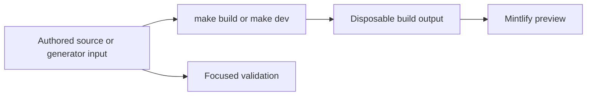

# Quickstart

This repository builds the Mintlify site at [docs.langchain.com](https://docs.langchain.com) from authored files in `src/`. The pipeline recreates `build/`, which Mintlify serves and deploys: **never edit `build/`**. API reference at [reference.langchain.com](https://reference.langchain.com/python/) is generated outside this repository; report problems through the [reference documentation issue template](https://github.com/langchain-ai/docs/issues/new?template=04-reference-docs.yml).



This flow separates editable inputs from derived preview and publication artifacts.

## Start a local preview

Use Python 3.13 or later, Node.js, and `uv`:

```bash
git clone https://github.com/langchain-ai/docs.git
cd docs
make install
make dev
```

`make install` synchronizes all Python dependency groups, installs project npm dependencies and the global Mintlify CLI, and links Claude Code skills. Open <http://localhost:3000>. `make dev` performs an initial build, watches `src/`, and launches `mint dev --port 3000` from `build/`; if the initial build fails, it exits instead of serving stale output. Use `uv run pipeline dev --skip-build` only when an existing build is suitable. Use `make build` for a clean reconstruction, then inspect the route you changed.

## Route the change to its owner

Read `AGENTS.md` (identical to `CLAUDE.md`) before editing. Repository-wide rules live there; task-specific procedures are `SKILL.md` files under `.agents/skills/`. Most supported agents discover that tree directly. Claude Code needs `make skills` to link it under `.claude/skills/`.

`src/docs.json` is the Mintlify site configuration and the source of truth for navigation, redirects, and generated OpenAPI placement. A visible navigation label is not a source directory. Add new authored pages to the appropriate product, menu, tab, and group; retain or add redirects when moving or removing a public route.

| If you are changing | Edit this owner | Output and first check |
| --- | --- | --- |
| Shared LangChain, LangGraph, Deep Agents, or OSS conceptual content | `src/oss/` | Most content emits both `/oss/python/...` and `/oss/javascript/...`; inspect both language variants. |
| Python- or JavaScript-specific OSS content | `src/oss/python/` or `src/oss/javascript/` | Inspect the matching language route and its navigation entry. |
| OpenWiki | `src/oss/openwiki/` | It emits once at `/oss/openwiki/...`; inspect that unversioned route. |
| Deep Agents Code | `src/oss/deepagents/code/` | It emits once at `/oss/deepagents/code/...`; inspect that unversioned route. |
| Ordinary LangSmith authoring | `src/langsmith/` | It emits unversioned `/langsmith/...` routes. Place it in Test, Deploy, Monitor, LangSmith setup, LLM Gateway, or Engine as appropriate. |
| No-code agents | `src/langsmith/fleet/` | The source directory and URL use `fleet`, although the navigation label is **No-code agents**. |
| Managed Deep Agents | `src/langsmith/managed-deep-agents*.mdx` | Inspect `/langsmith/python/...` and `/langsmith/javascript/...`; unversioned legacy URLs redirect to Python. |
| Runnable example or its displayed snippet | `src/code-samples/` | Test source, then regenerate. `src/code-samples-generated/` and `src/snippets/code-samples/` are derived inputs/output and must not be hand-edited. |
| Hosted integration listing | Hosted guide `integration:` frontmatter, `scripts/data/integration_external_docs.yaml`, provider cards, or `packages.yml` | Generated listings and the Python provider overview must be regenerated from their inputs. |
| LangSmith REST endpoint documentation | The upstream service contract or `scripts/process_langsmith_openapi.py` | `src/langsmith/langsmith-platform-openapi.json` is generated; Mintlify creates endpoint pages at deployment. Do not author endpoint MDX. |
| Agent Server or Control Plane API reference | Agent Server spec or the configured OpenAPI declaration in `src/docs.json` | Mintlify creates endpoint pages at deployment. Run `make check-openapi` for the Agent Server spec. |

For the detailed source-to-route and navigation map—including LangSmith setup, BYOC, self-hosted, Playground, tracing, LLM Gateway, Engine, Sandboxes, and the generated REST sections—see [Source Map](/openwiki/architecture/source-map.md).

## Change generated content at the input

- **Provider overview:** `src/oss/python/integrations/providers/overview.mdx` is generated from `packages.yml` by `pipeline/tools/partner_pkg_table.py`. Change an input or generator, run `uv run python pipeline/tools/partner_pkg_table.py`, and commit the result. CI rejects a regenerated diff.
- **Integration tables:** hosted-guide frontmatter and `scripts/data/integration_external_docs.yaml` generate integration snippets. A `docs_url` may use `https://`, `http://`, or a single-slash site-relative path; protocol-relative and unsafe schemes are rejected. Validate and regenerate with:

  ```bash
  uv run python scripts/refresh_integration_downloads.py --check-docs-urls
  uv run python scripts/refresh_integration_downloads.py --write
  ```

- **Code samples:** execute the changed source before regenerating its visible snippet:

  ```bash
  make test-code-samples FILES="src/code-samples/langchain/return-a-string.py"
  make code-snippets
  ```

  The runner supports Python, TypeScript, Java, Kotlin, Go, and shell files. Fork pull requests skip the credential-bearing workflow. Internal pull requests test changed supported files; scheduled and manual full runs test all samples, enable tracing, regenerate snippets, and update a trace-refresh pull request only after success.
- **LangSmith REST spec:** a daily or manually dispatched workflow runs `uv run python scripts/process_langsmith_openapi.py --write` and updates one `chore/refresh-langsmith-openapi` pull request only when the processed spec differs. Change processor rules or the upstream contract, not `src/langsmith/langsmith-platform-openapi.json` by hand.

## Run the smallest relevant validation

Build and inspect affected routes after changing authored pages, navigation, shared assets, preprocessors, or generator inputs. Then choose the narrowest relevant check.

| Boundary | Command | What it covers |
| --- | --- | --- |
| Pipeline, builder, watcher, or generator behavior | `make test TEST_FILE=tests/unit_tests/path_or_test.py` | Pytest with network sockets disabled except Unix sockets. Omit `TEST_FILE` for the default unit-test tree. |
| Finished prose | `make lint_prose FILES="src/path/to/page.mdx"` | Vale with the pinned binary. |
| Python tooling or spelling | `make lint` | Ruff format/check, `ty`, and Codespell. |
| Built routes, links, anchors, and redirect destinations | `make broken-links-with-anchors` | Fresh build followed by Mintlify link, anchor, and redirect checking. |
| Authored `@[ref]` references | `make check-cross-refs` | Source reference mappings, independently of rendered-link checking. |
| Runnable sample and derivative | `make test-code-samples FILES="..."`; `make code-snippets` | The executable source, then refreshed snippet MDX. |
| Integration external metadata | `uv run python scripts/refresh_integration_downloads.py --check-docs-urls` | Permitted `docs_url` schemes without writes. |
| Provider overview | `uv run python pipeline/tools/partner_pkg_table.py` | Generated overview agrees with its inputs. |
| Agent Server OpenAPI spec | `make check-openapi` | Builds first and validates the Agent Server spec. |

Core CI runs on pushes to `main`, pull requests, and manual dispatch. Its separate jobs cover unit tests, lint, anchor-aware links, cross-references, integration URL safety, provider-overview regeneration, and merge-conflict markers. A passing unrelated check is not a substitute for the check that covers the changed boundary.

## Before opening a pull request

- Confirm every edit targets authored content, configuration, metadata, or a generator—not `build/` or another derivative.
- Update `src/docs.json` for a new route, navigation placement, or redirect.
- Inspect every emitted variant required by the source family.
- Run focused checks and disclose unavailable credentials or external-service dependencies.
- Review generated snippet, integration, provider-overview, and OpenAPI changes together with their inputs.

## Related pages

- [Build System Architecture](/openwiki/architecture/build-system.md)
- [Source Map](/openwiki/architecture/source-map.md)
- [GitHub Actions and CI/CD](/openwiki/integrations/github-actions.md)
- [Adding and Maintaining Documentation Pages](/openwiki/operations/adding-pages.md)
- [Code Sample Lifecycle](/openwiki/workflows/code-sample-lifecycle.md)
- [Local Development Workflow](/openwiki/workflows/local-development.md)
