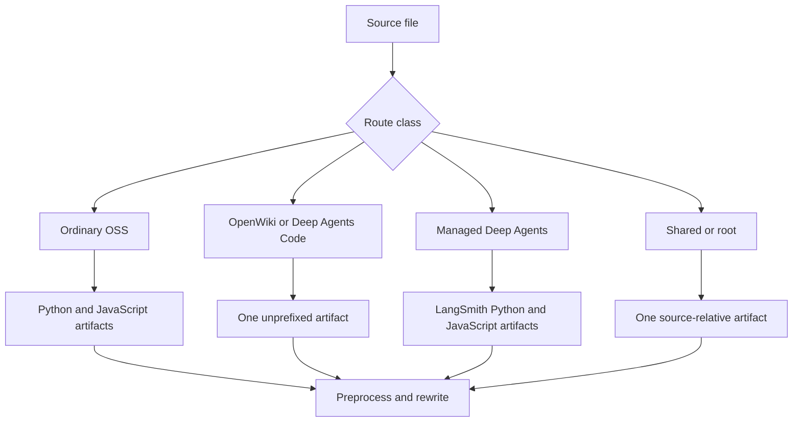

# Builder Test Guidance

`DocumentationBuilder` is the filesystem boundary between authored `src/` content and disposable `build/` artifacts. Test observable contracts: emitted routes, routes that must be absent, transformed final text, copied bytes, generated indexes, and raised failures. Prefer these over private call-count assertions. See [Build System](/openwiki/architecture/build-system.md), [Language Versioning](/openwiki/concepts/versioning.md), [Conditional Rendering Tests](/openwiki/testing/conditional-rendering.md), and [Testing Overview](/openwiki/testing/test-overview.md).

Run the focused, socket-isolated suite with:

```bash
make test TEST_FILE=tests/unit_tests/test_builder.py
```

`make test` invokes pytest with sockets disabled (apart from Unix sockets). Keep these tests offline: use temporary trees, local fixture files, and mocks; do not require Mintlify, an npm registry, or a running watcher observer. Use `tests/unit_tests/test_watcher.py` for the event-filter seam.

## Fixture harness and assertion style

Use `File` and `file_system()` from `tests/unit_tests/utils.py`. The context manager creates a temporary `src/` and `build/`, writes UTF-8 `content` or binary `bytes`, provides `list_build_files()` and `build_file_exists()`, and deletes the tree on exit.

```python
with file_system([
    File(path="oss/guide.mdx", content="---\ntitle: Guide\n---\n\nBody."),
]) as fs:
    builder = DocumentationBuilder(fs.src_dir, fs.build_dir)
    builder.build_file(fs.src_dir / "oss/guide.mdx")

    assert fs.build_file_exists("oss/python/guide.mdx")
    assert fs.build_file_exists("oss/javascript/guide.mdx")
    assert not fs.build_file_exists("oss/guide.mdx")
```

Keep fixtures minimal, but include the consuming page when an import or route rewrite is the behavior under test. Read the emitted file for transformations. Assert both selected and excluded conditional content, every expected output route, and the unwanted sibling route. For copied assets, assert bytes rather than treating an asset as text.

## Route classes: assert artifact families



This diagram shows the artifact families that route-changing tests must cover.

- **Ordinary OSS:** content below `oss/` emits `oss/python/...` and `oss/javascript/...`. In a full build, a source below `oss/python/` or `oss/javascript/` participates only in its matching pass, and that leading source-language directory is removed from the output path.
- **Intentional unversioned OSS:** `oss/deepagents/code/` and `oss/openwiki/` each emit one source-relative artifact. They use the Python conditional target; links within either product stay unprefixed, while an ordinary OSS link is rewritten to the Python route.
- **Managed Deep Agents:** a direct `.md` or `.mdx` child of `langsmith/` whose filename begins `managed-deep-agents` emits only `langsmith/python/...` and `langsmith/javascript/...`. No unversioned page is emitted. The full-build discovery glob is `managed-deep-agents*.mdx`, however, so use `.mdx` to test normal full-build discovery; `.md` only demonstrates `build_file()` classification.
- **Shared and simple content:** `docs.json`; four named root pages; any `snippets`, `images`, `.well-known`, or `fonts` path component; and `.js` or `.css` files emit once. Local `.jsx` and `.tsx` files are supported but are shared only when their path is under `snippets`.

The intake allowlist has 22 suffixes: Markdown, JSON, SVG, image and video formats, YAML, CSS/JavaScript, JSX/TSX, text, fonts, and HTML. Unsupported suffixes and `TEMPLATE.mdx` are skipped. A file named exactly `docs.yml` is parsed with `yaml.safe_load` and emitted as `docs.json`; other supported YAML is copied. Test an allowlist or classifier change with the exact set plus an artifact-boundary assertion.

## Markdown transforms and safe snippet expansion

For Markdown and MDX, test the actual order: `preprocess_markdown()`, language-scoped snippet import rewrite when a target exists, OSS link rewrite, Managed Deep Agents link rewrite, then the generated source-links footer. `.md` output becomes `.mdx`. Preprocessing failures are logged and re-raised; the footer is best-effort and returns unchanged content if it fails.

Use [Conditional Rendering Tests](/openwiki/testing/conditional-rendering.md) for parser/fence behavior. At the builder boundary, protect these contracts:

- Bare Markdown links and HTML `href` values under `/oss/` gain `python` or `javascript`. Existing language prefixes, paths containing `images`, and Deep Agents Code/OpenWiki roots remain unchanged.
- Bare `/langsmith/managed-deep-agents...` links gain the active language. A qualified route remains qualified.
- Only default-import syntax for `/snippets/*.md` or `.mdx` is redirected to `/snippets/python/...` or `/snippets/javascript/...`. Already scoped Markdown imports and named component imports are not rewritten.
- A shared Markdown snippet emits a Python-default base file and Python and JavaScript copies. Its links are absolute and language-prefixed so nested consumers resolve correctly. Snippets have no source footer.
- Ordinary Markdown receives the generated GitHub edit/issue footer except root `index.mdx` and a path containing `snippets`.

When changing a regex, retain helper edge tests *and* an end-to-end `build_file()` or `build_all()` fixture that proves the emitted consumer chose the intended route. Do not claim a syntactic form is supported unless the fixture exercises it.

## Source and derived-input containment

Source discovery is a publication boundary. `_safe_source_files()` excludes every symlink, even one to a regular file, and rejects a resolved file outside the requested root. Put an outside secret beside a fixture tree, link to it from an eligible source directory, and assert it is neither collected nor copied.

`_resolve_within()` protects paths derived from editable MDX and `docs.json`: OpenAPI specifications must remain beneath `build/`, snippet imports used for `llms-full.txt` beneath `build/snippets`, and section-index writes beneath `build/`. Test an in-tree child and an escaping path. For traversal, create the relevant in-tree directory and an outside secret so the containment guard—not an absent directory—causes the rejection.

## Generated LLM artifacts: generation and invariant tests

A full build clears the build tree, emits content, copies shared files, overlays npm components, then produces `llms.txt` and `llms-full.txt`. Use small `build_all()` fixtures for generation and direct helper fixtures for malformed-index failures.

### `llms.txt`

`llms.txt` indexes eligible MDX pages and inferred OpenAPI operation pages. It excludes `snippets/` and frontmatter `noindex: true`; page titles and optional descriptions supply index text. Small sections remain in root. Larger sections are delegated from root to direct section indexes, each named exactly `llms.txt`; splitting happens by directory rather than numbered filenames. Root entries are grouped and labeled so a reader can select an index without fetching every one.

`_validate_llms_indexes()` enforces the published-tree invariant, not just generator internals. It raises `ValueError` if root or a linked section exceeds 50,000 characters, a root-linked section is missing, a section links to another `.txt` index, a page URL is duplicated, or unique listed pages differ from the expected count. Retain a valid root-plus-section control alongside each failure fixture.

### OpenAPI discovery

OpenAPI pages have no MDX source, so `_openapi_entries()` recursively walks `docs.json` navigation to locate `openapi` objects, reads each contained JSON spec, and adds each visible operation. A page route is based on configured `directory`, the first tag, and `summary` (or `operationId`); duplicate summaries get numeric suffixes. `x-hidden` operations are omitted. `_tag_slug()` preserves underscores, unlike ordinary `_slugify()`, because distinct tag routes can differ only by underscore versus hyphen.

An OpenAPI fixture should include nested navigation, a local spec, a hidden operation, duplicate summaries, and underscore-bearing tags. Assert exact derived slugs in addition to the `llms.txt` or corpus effect.

### `llms-full.txt`

The full corpus likewise excludes snippets and `noindex` pages. It strips frontmatter and records a heading and source URL for each page. Recognized single-quoted default snippet imports are removed and their self-closing component uses are replaced by recursively inlined bodies; recursion stops beyond depth six, and an escaping import is ignored. Component props do not affect the plain-text body.

Python and JavaScript OSS variants are placed in `oss/python/llms-full.txt` and `oss/javascript/llms-full.txt`; root `llms-full.txt` starts with site metadata, points at those corpora, and holds unversioned pages. Inferred OpenAPI operations add a heading and source URL but no body. Assert language separation, an inlined unique snippet token, disappearance of the import line, and absence of a traversal secret.

## Entrypoints, overlays, and watcher limitations

`build_all()` is the consistency operation: it clears stale output and regenerates package overlays and LLM artifacts. `build_file()` routes one existing file and raises `AssertionError` when it does not exist. `build_files()` delegates a single item to `build_file()`; with several items it uses a tqdm progress path disabled in CI. `build_command()` returns 1 for a missing source directory; otherwise it creates the requested build directory, calls `build_all()`, and returns 0.

The npm overlay is a filesystem contract, not a live package test. If `node_modules/@langchain/docs-sandbox/dist` is missing, the build warns and continues. When it is present, `PatternEmbed.jsx` and `ExampleEmbed.jsx` overwrite corresponding copies below `build/snippets/`, while `ChatLangChainEmbed.js` is copied to the build root. Construct that directory locally beside the fixture source tree to test mappings or precedence.

`DocsFileHandler` ignores names ending `~`, `.bak`, or `.orig`, and hidden names ending `.tmp`, `.temp`, or `.swp`. Supported non-directory create/modify events are queued through `loop.call_soon_threadsafe`; creation delegates to modification. Use a new event loop and queue when modifying this seam, and cover accepted ordinary names as well as ignored names.

`FileWatcher` deduplicates pending paths, cancels and reschedules the debounce task for each event, sleeps 0.2 seconds after the last one, and builds one file in one worker or a batch with at most four workers. It then touches expected outputs for hot reload. Test debounce, batch limits, and touching with mocked builder calls and controlled async timing rather than an observer or wall-clock integration test.

Deletion is intentionally separate and incomplete: `DocsFileHandler` removes only the source-relative output path and does not apply the builder route map. Derived language artifacts can therefore remain until a full build. The touch logic handles dual-version and unversioned OSS paths but treats `langsmith` as source-relative, so Managed Deep Agents variants can be rebuilt without being touched for hot reload. A route-aware deletion or touching change needs positive and negative output assertions for every route family plus a full-build recovery test.

## Change checklist

1. Start with the smallest `file_system()` fixture that expresses the changed invariant.
2. Assert every affected route, absent sibling route, and final transformed content for each target language.
3. Use binary assets for copy behavior and hostile external paths for collection or derived-input safety.
4. For index work, pair a small generation fixture with direct validator failures and a valid control index.
5. Keep watcher tests asynchronous and offline; test filtering, queuing/debounce, building, touching, and deletion independently.
6. Run the focused builder module first. Run broader build or link validation only when the contract crosses into generated-site integration.
