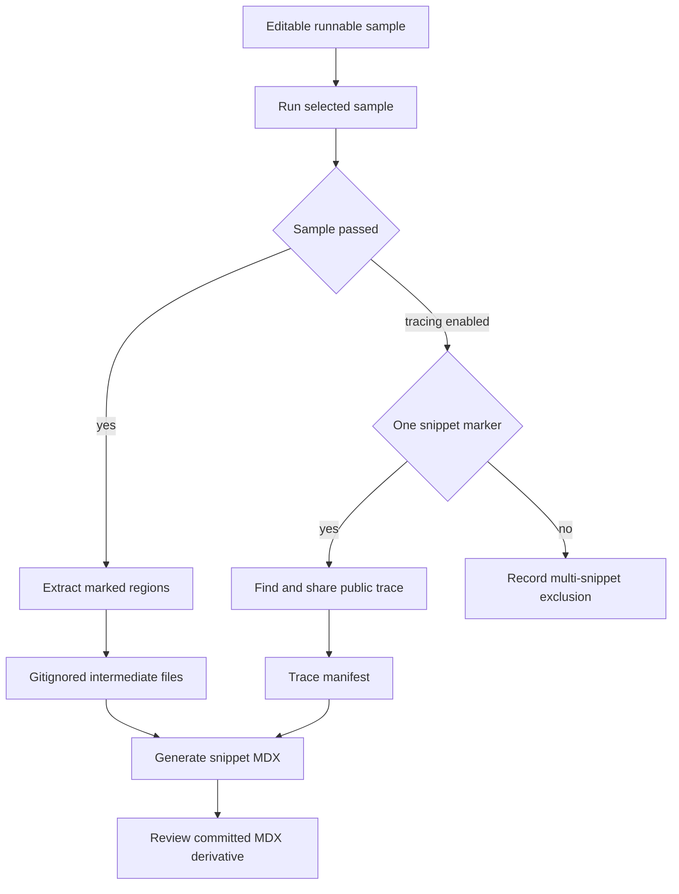

## Ownership and lifecycle

Runnable examples in `src/code-samples/` are the editable source of truth. They are programs with marked documentation regions, so the code readers see is exercised by its language toolchain. `src/code-samples-generated/` is a gitignored extraction intermediate; committed files in `src/snippets/code-samples/` are generated MDX derivatives. Change and review the runnable source and regenerated MDX diff—do not hand-author the derivative.



This shows the source-to-documentation lifecycle and the separately gated public-trace branch.

## Author marked, executable source

Supported source extensions are `.py`, `.ts`, `.java`, `.kt`, `.go`, and `.sh`. Delimit visible code with matched `:snippet-start: <id>` and `:snippet-end:` comment lines: Python and shell use `#`; TypeScript, Java, Kotlin, and Go use `//`. The extractor is line based, permits indented markers, removes matched `:remove-start:` / `:remove-end:` regions inside an extracted body, dedents and normalizes the result, and rejects unclosed snippet or remove markers.

Every ID needs its output-language suffix: `-py`, `-js`, `-java`, `-kt`, `-go`, or `-sh`. The generator uses it to choose the fence language and skips an extracted snippet whose ID does not match its source language. Use a unique descriptive kebab-case ID: it determines the MDX filename.

Keep the visible path executable. Put assertions, credentials-only setup, and non-display execution tails in a trailing remove block when possible, but never short-circuit before imports, construction, or invocation have executed. An early successful `SystemExit`, `process.exit`, or `exit 0` only proves parsing.

### MCP lifecycle examples

The MCP samples show the ownership boundary in concrete form:

- `src/code-samples/langchain/mcp-multimodal-tool-content.py` has one visible `mcp-multimodal-tool-content-py` region. It creates an MCP adapter and agent, asks for a screenshot, and iterates `ToolMessage.content_blocks` to handle normalized text and image blocks. Its hidden tail defines a local `FastMCP` screenshot server with a tiny PNG, runs the example, and asserts an image block. If the model cannot process the image, it directly invokes the adapted tool and still validates the adapter’s multimodal conversion.
- `src/code-samples/langchain/mcp-tool-results.py` deliberately owns two documentation regions: `mcp-tool-errors-py` shows that a server `isError` result is surfaced as a failed `ToolMessage` for the agent to read, while transport failures still raise; `mcp-tool-metadata-py` reads the MCP destructive hint defensively from nested tool metadata. Its hidden harness runs a local divide-by-zero MCP server, accepts either the failed tool message or an assistant response mentioning the error, then verifies the adapter metadata.

The corresponding MDX files contain only the marked reader-facing bodies: `mcp-multimodal-tool-content-py.mdx` excludes the PNG server and assertion harness, and `mcp-tool-errors-py.mdx` excludes the local calculator and validation logic. Because the latter source has two snippet markers, it is intentionally ineligible for a per-sample public trace until it is split; the single-marker multimodal source can be eligible when tracing is enabled.

For these changed samples, run the programs first and then regenerate just their extraction inputs:

```bash
make test-code-samples FILES="src/code-samples/langchain/mcp-multimodal-tool-content.py src/code-samples/langchain/mcp-tool-results.py"
CODE_SNIPPET_SOURCES="src/code-samples/langchain/mcp-multimodal-tool-content.py src/code-samples/langchain/mcp-tool-results.py" make code-snippets
```

Review both generated MDX files after the second command. Partial extraction is useful for this focused loop, but it does not make repository-wide generated state complete.

### Scope and presentation rules

One source file can own related snippets and a shared harness, which is particularly useful for Python. TypeScript runs as one module: visible regions and remove blocks share imports and top-level bindings. Split independently runnable TypeScript snippets into separate files when imports or `const`, `let`, class, function, or setup names would collide.

The Deep Agents skills expansion demonstrates this tradeoff. `skills.py` contains multiple Python regions and is intentionally ineligible for a single-snippet trace. The approval, source-composition, and writable-store TypeScript samples each contain one visible marker and a trailing remove-block assertion. The single-marker LangGraph multiple-schemas TypeScript sample similarly keeps its assertion harness hidden and has a generated trace card.

Optional presentation directives must be the first lines inside the extracted body: `:codegroup-tab:` supplies a Mintlify tab title and `:codegroup-fence-mods:` supplies fence modifiers. Both are stripped from emitted code.

For Python and TypeScript, the generator can expand a qualifying routable `model` string into a seven-provider Deep Agents `<CodeGroup>`. `# KEEP MODEL` or `// KEEP MODEL` immediately before an occurrence pins it. Expansion excludes embedding and provider-specific constructor models such as `ChatOpenAI`, because replacing those values with a `provider:model` string would make the output non-runnable. A trace-manifest URL appends a `View example trace` CTA.

### Go module boundary

All Go examples share the module rooted at `src/code-samples/go.mod`; its `go 1.25.0` directive also supplies CI's Go version. Add dependencies there and commit matching checksums in `src/code-samples/go.sum`, rather than creating per-example modules. The runner invokes `go run` from `src/code-samples/`, so nested samples resolve dependencies through that module.

## Execute samples and handle failure

Use a narrow check while authoring, then broaden when shared dependencies or execution behavior changes:

```bash
make test-code-samples FILES="src/code-samples/langchain/return-a-string.py"
make test-code-samples
make test TEST_FILE=tests/unit_tests/test_generate_code_snippet_mdx.py
```

`FILES` is a space-separated explicit list. Missing, unsupported, or out-of-tree entries are warned about and skipped. Without it, the runner recursively selects eligible files under `src/code-samples/`, excluding `node_modules` and `__pycache__`, in Python, TypeScript, Java, Kotlin, Go, then shell order.

Python runs through `uv run python`; TypeScript uses `npx tsx`; Go uses `go run`; shell uses `bash`; Java and Kotlin use JBang with Java 21. TypeScript, Go, and shell use `src/code-samples/` as their working directory; Python and JBang use the repository root. Child processes inherit credentials and `POSTGRES_URI`, so samples can exercise live APIs or PostgreSQL. The per-sample timeout defaults to 1,200 seconds and is configurable with `CODE_SAMPLE_TIMEOUT_SECONDS`.

A nonzero exit, timeout, missing executable, or trace-collection exception fails the runner. The exception is a detected LangSmith 429: it retries three total attempts with 15-second delays, then reports the sample as skipped rather than failed. A skipped sample is not validation and cannot produce a trace.

## Extract and regenerate MDX

Run:

```bash
make code-snippets
```

The target extracts before it generates MDX. Extraction writes `<source-stem>.snippet.<snippet-id>.<extension>` under `src/code-samples-generated/`, retaining a product subdirectory based on source layout. Generation scans all supported intermediates, formats valid-suffix bodies as fences or CodeGroups, applies a trace CTA from the manifest when present, and writes `<snippet-id>.mdx` under `src/snippets/code-samples/`.

For local iteration, limit extraction:

```bash
CODE_SNIPPET_SOURCES="src/code-samples/langsmith/trace.java" make code-snippets
```

`CODE_SNIPPET_SOURCES` accepts existing supported files below `src/code-samples/`. A full extraction deletes supported intermediates and rebuilds them all. A partial extraction replaces intermediates only for selected source stems, while MDX generation still scans every intermediate left behind. Use a full run before relying on complete repository state.

## Intentional public trace publication

`make update-code-sample-traces` is a public-publication operation, not ordinary validation. It requires `LANGSMITH_API_KEY`, enables `CODE_SAMPLE_TRACING=1`, selects `LANGSMITH_PROJECT` or `docs-code-samples`, runs the samples with tracing, then regenerates MDX. Use credentials and inputs appropriate for public visibility.

For each successful source, the collector counts snippet markers. No marker produces no link. Exactly one marker is eligible: it flushes and polls six times with two-second waits for a recent agent-like root run, shares the selected run, and records URL, source, run ID, trace ID, name, and update time under the snippet ID. More than one marker is recorded in `skipped_multi_snippet`, and stale per-snippet entries are removed. `src/code-samples/trace-links.json` owns this association; generation adds a card for a manifest URL and removes a stale trailing CTA when it is absent.

## CI trust and refresh behavior

The **Test Code Samples** workflow runs on relevant pull requests, manual dispatch, and monthly scheduled runs at 00:00 UTC on the first day. It skips fork PRs because samples can require secrets. Internal PRs calculate the merge base and run changed eligible sample files; manual and scheduled runs test all samples. CI provides Python and uv, Node 20, Java 21 and JBang, Go from `src/code-samples/go.mod`, and pgvector PostgreSQL.

Only manual and scheduled full runs enable trace collection. After a successful full run, CI regenerates snippets and updates or creates `chore/refresh-code-sample-traces` only if `trace-links.json` or generated snippet MDX differs. Pull-request checks do not publish traces or generated artifacts. A separate observer creates a Linear issue only for failed or cancelled scheduled sample runs.

## Change checklist

1. Change runnable source in `src/code-samples/`, not generated MDX.
2. Use matched language-correct markers and a unique suffix-bearing ID.
3. Run the visible path; reserve trailing hidden code for meaningful harness logic.
4. For MCP updates, run both focused source files and regenerate their derivatives with `CODE_SNIPPET_SOURCES`; inspect that hidden local servers and assertions did not enter MDX.
5. Keep Go dependencies in the shared module and split TypeScript where module scope collides.
6. Run `tests/unit_tests/test_generate_code_snippet_mdx.py` when changing CodeGroup behavior; run full extraction before relying on repository-wide output.
7. Treat trace refreshes as explicit credentialed public publication.

## Related pages

- [GitHub Actions and CI/CD](/openwiki/integrations/github-actions.md)
- [CLI Tools](/openwiki/operations/cli-tools.md)
- [Quickstart](/openwiki/quickstart.md)
- [Testing Overview](/openwiki/testing/test-overview.md)
