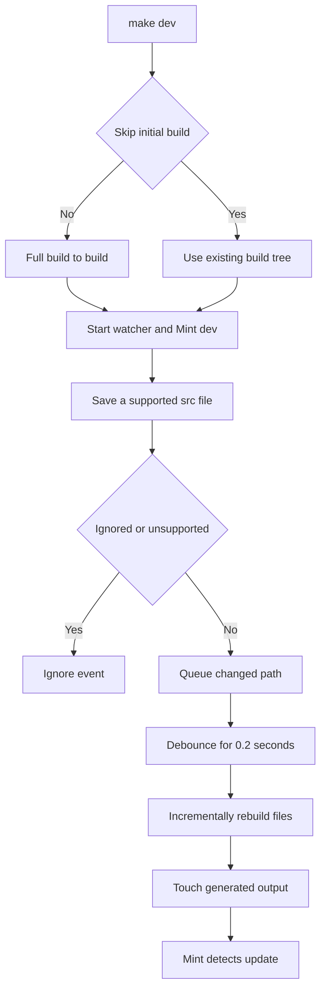

# Local Development Workflow

The local loop has a strict boundary: author documentation, navigation, and assets in `src/`; the Python pipeline generates Mintlify's `build/` tree. `build/` is disposable output, so never edit it directly. A full build removes and recreates it.

## Set up the checkout

The repository requires Python 3.13 or later, Node.js, and `uv`. Install all Python dependency groups, npm packages, the global Mintlify CLI, and Claude Code skill links with:

```bash
git clone https://github.com/langchain-ai/docs.git
cd docs
make install
```

`make install` runs `uv sync --all-groups`, `npm install`, and `npm install -g mint@latest`, then invokes `make skills`. The skill target links canonical `.agents/skills/<name>/` directories into the gitignored `.claude/skills/` directory, preserves existing non-symlink entries, and removes stale symlinks. Re-run `make skills` after pulling a new or renamed skill. If the `docs` console script is unavailable, start a new shell; check the separate Mint installation with `mint --version`.

## Choose an entrypoint

Use Make targets for ordinary checkout work. Both `make dev` and `make build` run `npm install` and invoke the pipeline with the repository root on `PYTHONPATH`.

```bash
make dev                         # full build, watch, and local preview
make build                       # full build, then exit
uv run pipeline dev              # direct development command
uv run pipeline dev --skip-build # reuse an existing build tree
uv run pipeline build            # direct one-shot build
```

The installed `docs` command is the CLI entrypoint. Although it exposes `docs build --watch`, the build command does not inspect that option: it performs one build and returns. Use `dev` for supported watch behavior.

## Run the edit–preview loop

```bash
make dev
```

Unless `--skip-build` is set, development mode runs a complete build first. Only after that build succeeds does it create a recursive `watchdog` watcher for `src/` and launch `mint dev --port 3000` from `build/`. Browse <http://localhost:3000> to inspect the generated route, navigation, formatting, and links.



This is the preview lifecycle: the initial full build establishes a coherent generated tree, while later source-file events take the incremental path.

### Startup, failure, and shutdown

An initial build failure returns failure before watcher or Mint startup. `--skip-build` deliberately bypasses that guard and merely warns if `build/` is absent, so use it only when an appropriate generated tree already exists. If `mint` is unavailable, the command exits with installation guidance. Once running, a nonzero Mint exit, watcher cancellation, or an unexpected watcher stop makes development mode fail.

Press Ctrl+C to stop. The command asks the watcher to shut down, cancels a pending debounced rebuild, terminates Mint, waits up to five seconds, and kills Mint if it has not exited. It then gathers the watcher, process-wait, and log-forwarding tasks. On Windows Mint runs through a shell for `.CMD` compatibility; Unix uses direct execution.

## Understand incremental updates

The watcher queues created and modified files with builder-supported extensions: Markdown and MDX, JSON, images and video, YAML, styles, JavaScript/JSX/TSX, text, HTML, and fonts. It ignores editor backups ending in `~`, `.bak`, or `.orig`, plus hidden temporary files ending in `.tmp`, `.temp`, or `.swp`.

Queued paths are deduplicated. Each event resets a 0.2-second debounce task, batching rapid writes. A single file rebuilds on one worker; batches use a `ThreadPoolExecutor` with at most four workers and show percentage progress. After rebuilding, the watcher touches generated outputs so Mint sees a timestamp change and reloads. Versioned OSS content can update Python and JavaScript outputs, while OpenWiki and Deep Agents Code are unversioned.

Deletion is intentionally less capable than building: the handler removes the source-relative path under `build/` if present, rather than applying the builder's routing rules. Treat a deletion or move as a full-build boundary.

## Reset with a full build when the output is global

`make build` runs `DocumentationBuilder.build_all()` without watching. It clears `build/`, builds Python and JavaScript OSS variants; unversioned Deep Agents Code, OpenWiki, and LangSmith content; managed Deep Agents variants; then copies shared files and npm snippet components and generates LLM artifacts.

The incremental path calls per-file building only. It does not recollect shared files, overlay npm snippet components, or regenerate LLM artifacts, and its deletion behavior can leave routed variants behind. Run `make build` after navigation, routing, shared assets, snippet components, broad preprocessing, moves or deletions, or whenever the preview appears stale. Correct `src/` or the pipeline and rebuild—never patch `build/`.

For routing and preprocessing, see [Build System Architecture](/openwiki/architecture/build-system.md). For the generated tree's renderer-facing contract, see [Mintlify Integration](/openwiki/integrations/mintlify.md).

## Validate the changed boundary

Choose the narrowest check that establishes the relevant boundary:

| Change boundary | Command | What it checks |
| --- | --- | --- |
| Pipeline, preprocessing, routing, or watcher behavior | `make test` | Pytest with network sockets disabled except Unix sockets. Focus watcher filtering with `make test TEST_FILE=tests/unit_tests/test_watcher.py`. |
| Python tooling and spelling | `make lint` | Ruff format/check, `ty`, and Codespell on `src`. |
| Markdown style | `make lint_md` | Markdownlint under `src`; use `make lint_md_fix` to apply fixes. |
| Prose | `make lint_prose` | Installs the Vale version pinned in `.mise.toml` to `.bin/vale`, then checks `src` or `FILES`. |
| Generated links, anchors, and redirects | `make broken-links-with-anchors` | Builds first, runs Mint from `build/` with `--check-anchors` and `--check-redirects`, and filters known non-actionable reports. |
| Source `@[ref]` references | `make check-cross-refs` | Checks source references separately from Mint's built-site check. |

Focused watcher tests cover backup and temporary-file filtering. Add focused tests when changing event filtering, rebuild batching, routing, or shutdown behavior. See [Testing Overview](/openwiki/testing/test-overview.md) for the wider validation model.

## Run Mint safely and recover

Run raw `mint` commands from `build/`, never the project root. At the root, Mintlify can scan `.venv` package files and parse Python-package Markdown as MDX. Prefer Make targets, which build first and use the generated working directory:

```bash
make broken-links
make broken-links-with-anchors
```

For a raw command:

```bash
cd build
mint broken-links
```

Both link-check targets use `--check-redirects`, filter known deployment-generated and standalone-snippet reports, and fail only on remaining link-report lines. The anchor target also passes `--check-anchors`. The working-directory rule also applies to raw export and OpenAPI commands. If Mint reports compatibility errors, run `mint update` or `npm install -g mint@latest`.

When Mint warns that a new navigation page does not exist, ensure `src/docs.json` includes the root `index` route without an extension:

```json
{
  "group": "New group",
  "pages": ["new-group/index", "new-group/other-page"]
}
```

### Recovery checklist

1. Re-run `make install` if Python dependencies, npm packages, Mint, or skill links are missing.
2. For an initial-build failure or suspicious preview, run `make build` and fix `src/` or pipeline configuration.
3. If Mint exits, inspect its forwarded logs, update Mint when appropriate, and restart `make dev`.
4. For navigation, generated artifacts, routing, moves, or deletion behavior that incremental rebuilding cannot explain, run a full build.
5. Use raw Mint only after `cd build`; otherwise use the Make target.

## Related pages

- [Quickstart](/openwiki/quickstart.md)
- [Build System Architecture](/openwiki/architecture/build-system.md)
- [Mintlify Integration](/openwiki/integrations/mintlify.md)
- [CLI Tools](/openwiki/operations/cli-tools.md)
- [Testing Overview](/openwiki/testing/test-overview.md)
